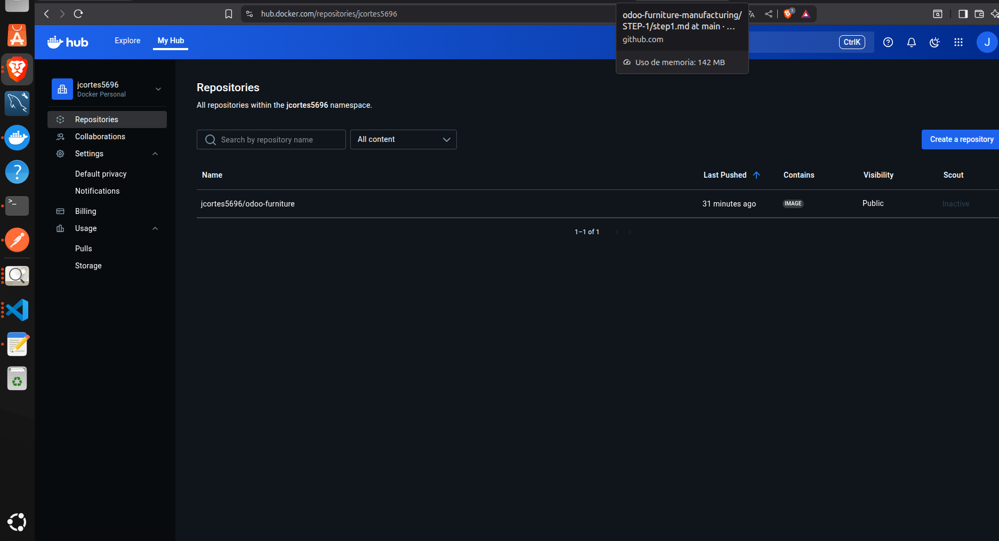
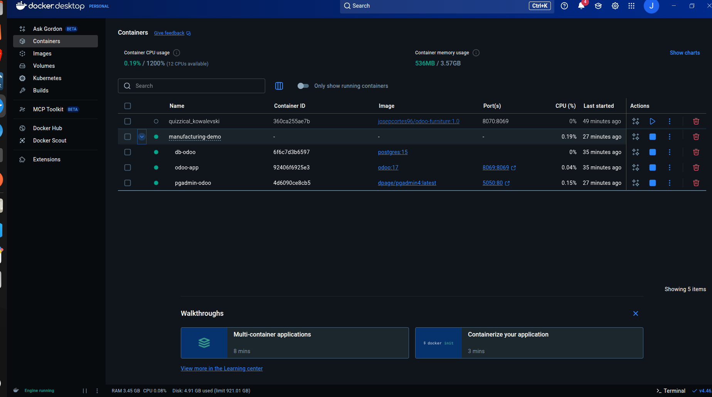
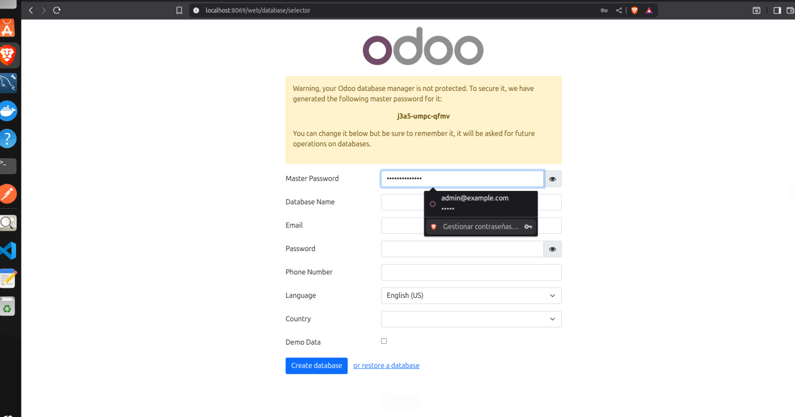
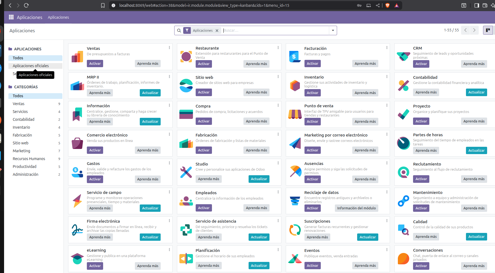
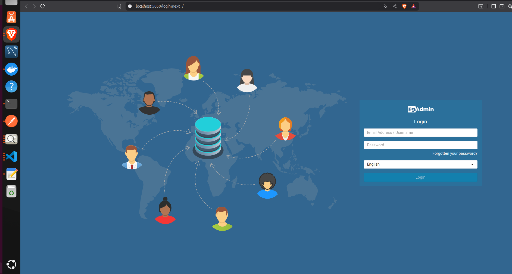
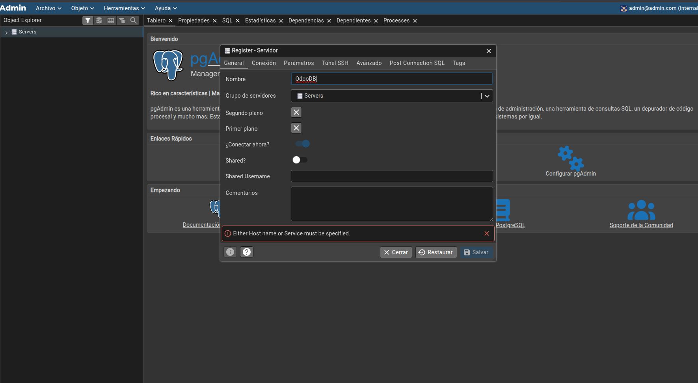
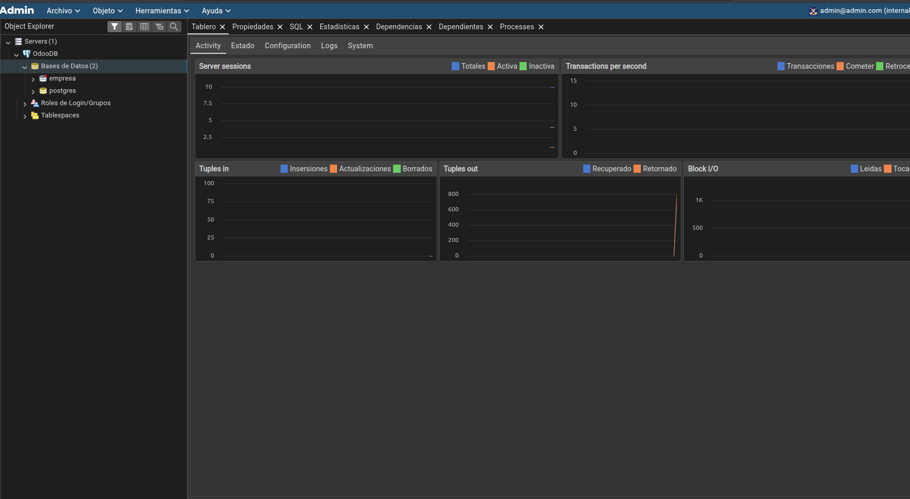

# ENVIRONMENT SETUP

## DOCKER

-To avoid having to download the entire Odoo core from its repository to our computer, we are going to create 3 different services.

First of all, we are going to create our docker compose defining the Odoo image, the db image (PostgreSQL) and finally, for ease of data visualization, another pgadmin service.

-For best practices, we will try to upload our image to Docker Hub

.

Subsequently, our Docker Desktop should look like this structure, as indicated by the docker-compose.

.
---
**For security** we create the .gitignore file, which would have the structure we see in the root file. In order not to upload our keys that are in odoo.conf to the repository (even though it is a demo project, good practices will be followed).

## STEP 2 

Once we have these steps, we are going to configure our odoo.conf.

The odoo.conf is where all our environment keys are, the http port, the log file path and the addons file path.

The structure would look like this:

[options]
admin_password=
http_port=
db_host=
db_port=
db_user=
db_password=
addons_path=
logfile=

** Finally we start the container using docker compose up -d ** 

IMPORTANT: if you have more containers not related to the project after the -d you have to indicate the containers you want to start. Otherwise it will start all of them. 

## STEP 3 

Once everything is ready and the container is up, we proceed to go to localhost:<The port we have indicated to the composer>.

-We check if Odoo is up and then if our pgadmin is also up on its port. 

## Odoo

First of all, we are going to configure the Odoo startup.
.
 
Here we are going to start the Odoo database. 
We are going to fill in the master password with the one set in .conf.
The following fields will be to create the database of the fictitious company that we are going to use. We can fill in with a fictitious email and password. Same as in the db.

Since we are in a test environment we are going to select Demo Data, so Odoo will provide us with all the furniture test data (they come by default). This way we have the products with all their BOMs and we don't have to create them.

Once we have completed everything we create the database. We enter the email and password again, thus accessing the initial Odoo page.

.

## PGADMIN

Next, we have successfully created the database. We are going to proceed to access the PGADMIN interface.

We go to localhost on the port we have assigned it. After this, we enter in the entry menu the user that we have set in the docker compose 

.

When we enter the interface, we go to the servers part and click on register.

.

In the general part, the name we will put will be whatever we want.
Then in connection we are going to use those set in odoo.conf to be able to establish connection with Odoo. And it will finally show us the database created by Odoo.

.

