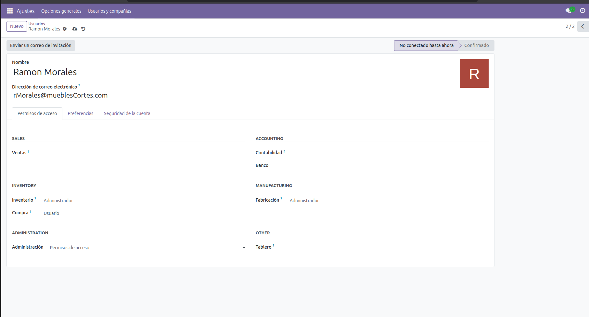
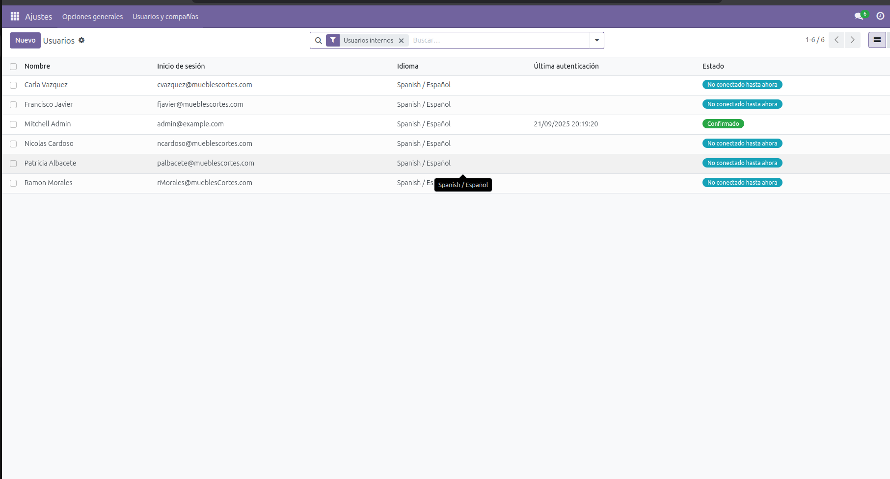
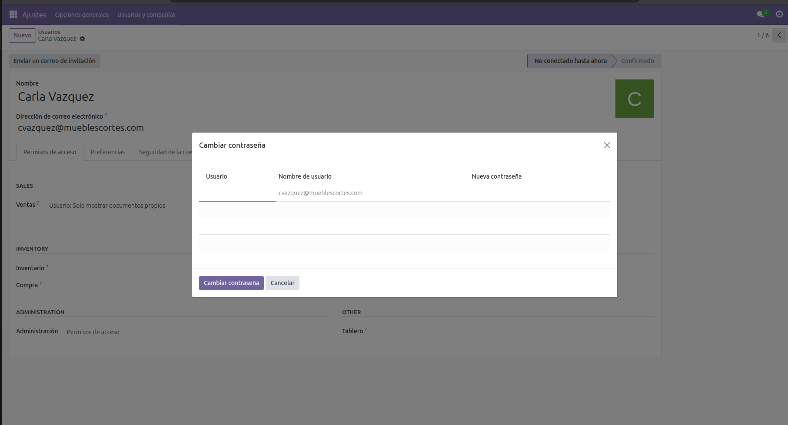
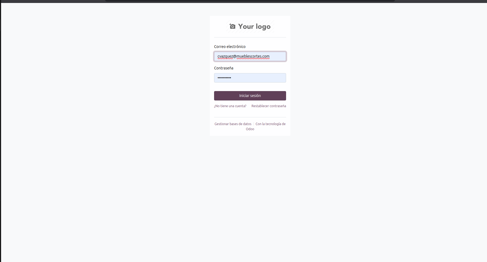
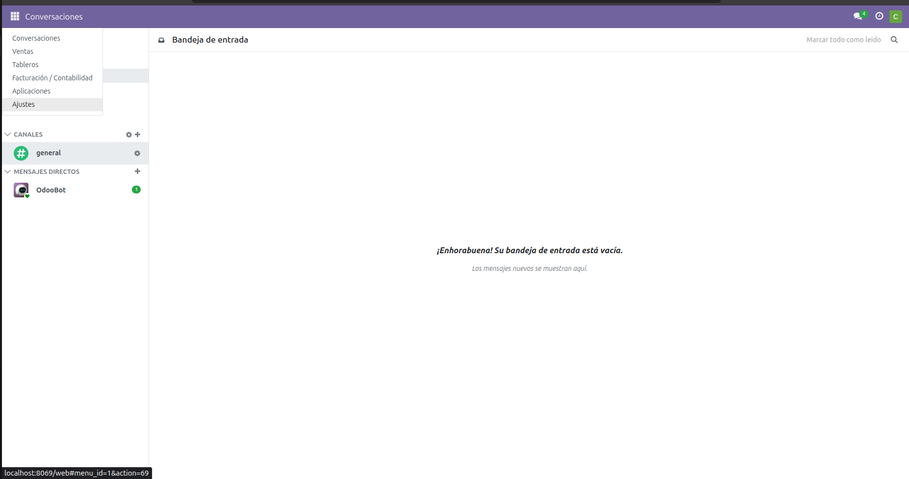

# USERS

## MODULE ACTIVATION

First of all, before diving into the operation of the modules and making the flow work, we are going to take care of creating the basic users for each part of the process, in order to have a semi-defined business structure.

We are going to assign different types of users:
- Sales Rep --> sales user.
- Production Manager --> In charge of all production.
- Operator --> User in production.
- Purchasing Manager --> Purchase administrator.
- Accounting --> In charge of company and customer invoicing.
- Sales Director --> In charge of all sales.

Once the structure is done, we proceed to the Odoo applications menu, we are going to activate the following modules:

- Sales.
- Purchases.
- Invoicing.
- Inventory.
- MRP.

## USER CREATION

To create users we go to the Applications Settings menu, exactly on the left side where we can see the square.

Once there we go to users and companies in the Users section. We are going to find the list of users, by default, we are going to find two: ours and a test one. We delete that user.

When we have completed this step we are going to create the users. At the top where it says new.

**IMPORTANT**
In the lower part under administration, access permissions must be set so that the user is capped by roles.

**DIFFERENTIATION**
User --> Can see things from the module validate some section.
Administrator --> Is in charge of the entire department and has all permissions in that department.

.

Once we have created all the users with all the permissions, we are going to see that they are in the list. And we will proceed to give each one a password. 

.

.

Once we give the user a password, we are going to test that the permissions are well configured.
- We close our session and try to access from the one we have assigned the password.

.

We can see in the following image how the user Carla Vazquez cvazquez@mueblescortes.com. 

Who has the role of sales rep, can only see the sales and invoicing part. Just as assigned.

.
